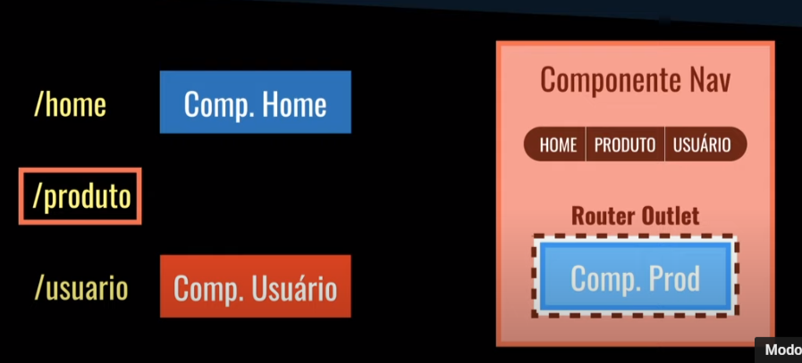
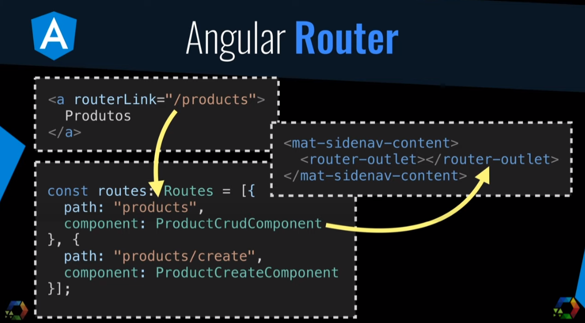

# Angular 9

<div align="center">
    
</div>

<p align="center">
  <a href="https://circleci.com/gh/angular/workflows/angular/tree/master">
    
  </a>&nbsp;
  <a href="https://www.npmjs.com/@angular/core">
    
  </a>&nbsp;
</p>

<br>

Esse projeto foi feito através do [Curso de Angular 9](https://www.youtube.com/playlist?list=PLdPPE0hUkt0rPyAkdhHIIquKbwrGUkvw3) da Cod3r Cursos no YouTube. Foi utilizado o Json-server para desenvolver um backend simples para que pudesse focar no frontend da aplicação.

<!-- ## O que é?
... -->

## <p style="background-color: #C3002F; padding-vertical: 5px; padding-left: 10px; border-radius: 7px;">Elementos do Angular</p>

### <strong>Componentes</strong>

São partes do código que podem ser reutilizadas em outras áreas do módulo. Eles são formados por 3 tipos de arquivos:

- home.component.css
- home.component.html
- home.component.ts

Eles também podem ser agrupados em um só HTML com as partes de TypeScript e CSS de forma inline. Além de ser possível colocar um template no arquivo .ts e colocar o documento HTML lá:

```
import { Component, OnInit } from '@angular/core';

@Component({
  selector: 'app-nav',
  template: '
  <html>
    ...
    <p>Olá mundo</p>
    ...
  </html>  
  ',
  styleUrls: ['./nav.component.css']
})
export class NavComponent implements OnInit {

  constructor() { }

  ngOnInit(): void {
  }
}
```

### <strong>Rotas</strong>

Para definir rotas e redirecionar o usuário na aplicação, o Angular segue uma lógica onde ele identifica a rota digitada e compara com as existentes. Depois de achar a escolhida, ele envia o componente para o Router Outlet, assim exibindo para o User:

<div align="center">
  
</div>

O código ficaria mais ou menos assim:

<div align="center">
  
</div>


<!-- ### <strong>Observables</strong>
... -->

### <strong>Diretivas</strong>

- Diretivas de atributos: Alteram a aparência e o comportamento de um elemento, componente ou outra diretiva.
<br>

```
/directive-test.ts

@Directive({
  selector: '[appRed]'
})

export class RedDirective {
  constructor(el: ElementRef) {
    el.nativeElement.style.color = '#e35e6b'
  }
}
```

```
/directive-test.html

<i class="material-icons v-middle">
  Favorite
</i>          // Coração Vazio


<i class="material-icons v-middle" appRed>
  Favorite
</i>          // Coração Preenchido
```

- Diretivas de estrutura: Altera o layout adicionando ou removendo elementos do DOM.
<br>

```
/directive-test.html

<form *ngIf="product"
  class="product-form">
  ...
</form> // Se a variável product existir ele exibe o form

<ul>
  <li *ngFor="let product of products">
    {{ product.name }}
  </li>
</ul> // Faz um loop criando Li's com base no que foi informado
```

<hr>

Também podemos ter Property Bindings, que seria uma maneira de interligar variáveis do TypeScript com o HTML. Pode ser feito dessa forma conectando a variável products:

````
/binding.html

<table 
  [dataSource]="products">
</table>
````
````
/binding.ts

...

export class ProductReadComponent
  implements OnInit {

    products: Product[];
}
````

O mesmo pode ser feito com eventos, interligando eles com uma função descrita no TypeScript:

````
/binding.html

<button mat-raised-button
  (click)="createProduct()"
  color="primary">
  Salvar  
</button>
````
````
/binding.ts

...

export class ProductCreateComponent implements OnInit {

    CreateProduct(): void {
      ...
    }
}
````
<hr>

Porém, esses bindings funcionam do TypeScript para o HTML, ou seja, as mudanças feitas no TS afetam o HTML e só nesse sentido elas acontecem.

Mas, podemos fazer com que as mudanças do HTML afetem o TypeScript e vice-versa:
```
/binging.html

<input [(ngModel)]="nome">
```
```
/binging.ts

nome: string
```


### <strong>Pipes</strong>
 Pipes são uma maneira de formatar dados interpolados no html dom Double Mustache (Chaves dupla). Elas podem ter parâmetros para a conversão também:

```
<p>
  O vencimento é 
  {{ produto.vencimento | date }}
</p>

Ou

<td mat-cell *matCellDef="let product">
  {{ produto.price | currency: 'BRL' }}
</td>

Ou 

<p>
  O vencimento é 
  {{ produto.vencimento | date: 'fullDate | uppercase }}
</p>
```
<!-- 
### <strong>Services</strong>
... -->
